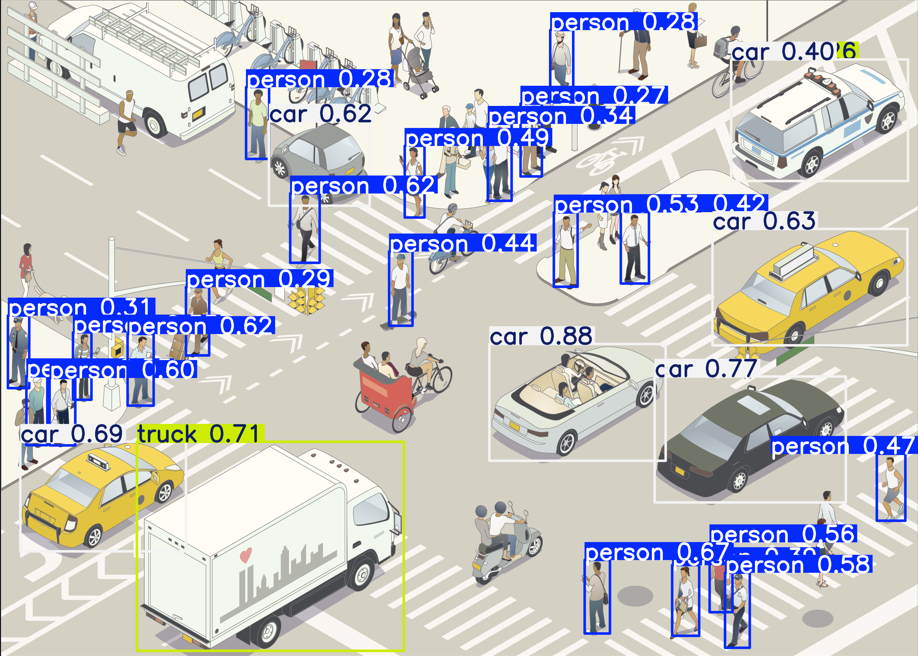

# 🕶️YOLOv10 학습 기록용 레포지토리입니다.
  
- YOLO 모델은 Ultralytics Python 패키지를 기반으로 구축된 실시간 객체 감지 딥러닝 모델로,  
작성 시점 기준으로 최신 버전인 YOLOv10 모델의 경우, 예측에 걸리는 시간을 최소화 함과 동시에 최고 수준의 정확도를 보여주는 우수한 모델입니다.
  
- 기초적인 예시로, 아래와 같은 물체 감지가 가능합니다.

  

    

      
    

    

      
    

  

